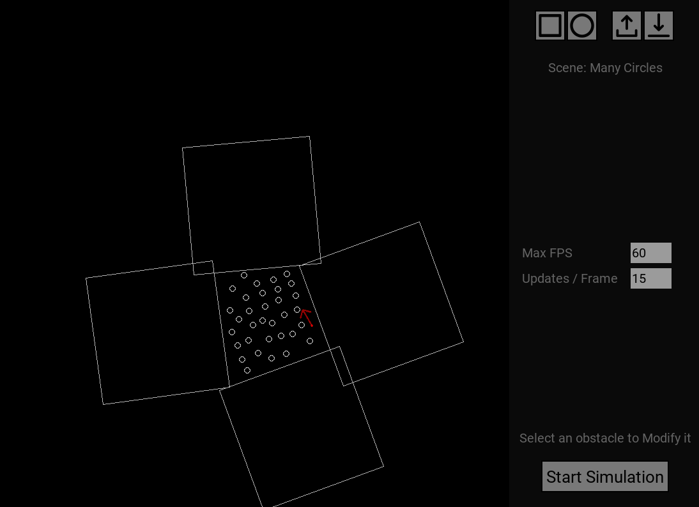
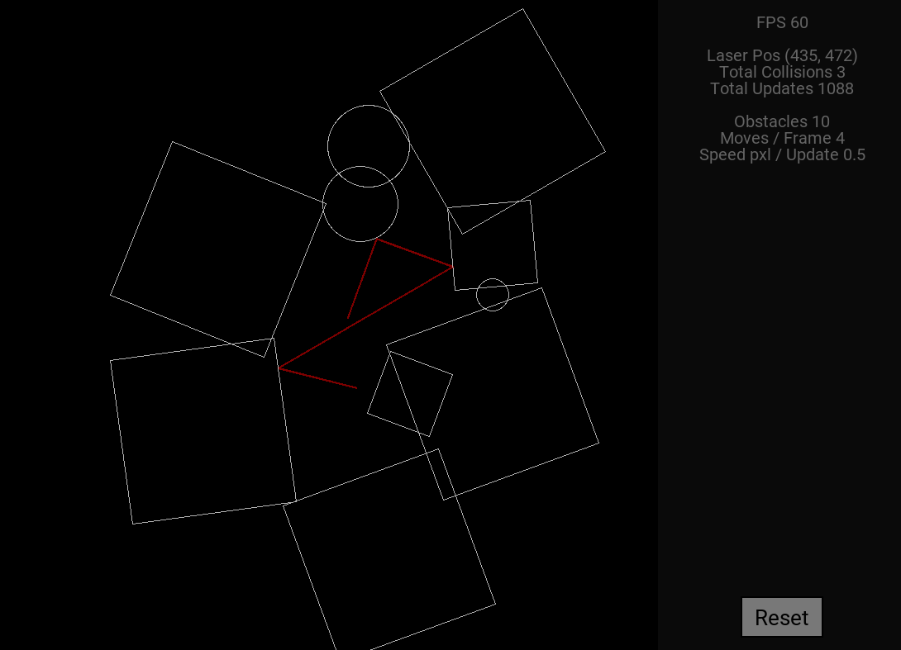

# Laser Simulation

<b>Laser simulation</b> is a simulator made by <i>Omppu42</i> <br>
Made using <i>Python, Pygame and tkinter</i> <br>

## Features
- Lazer bouncing
- Editor to configure the scene however you want to
- *Save and load* -system to keep track of different scenes 

# Requirements
**Python 3.9 - 3.10 is required.**<br>
NOTE: Python 3.11 is NOT supported <br> <br>
You can install python here:
https://www.python.org/downloads/

### Packages
To install all packages that are required, first navigate to the projects main folder, and run: <br>
```pip install -r requirements.txt```

# How to Run
After getting all the requirements sorted out, you can run the project. <br>
Navigate to ```LaserSimulation/src```.
<br> There, run: ```python3 main.py```


# Images


